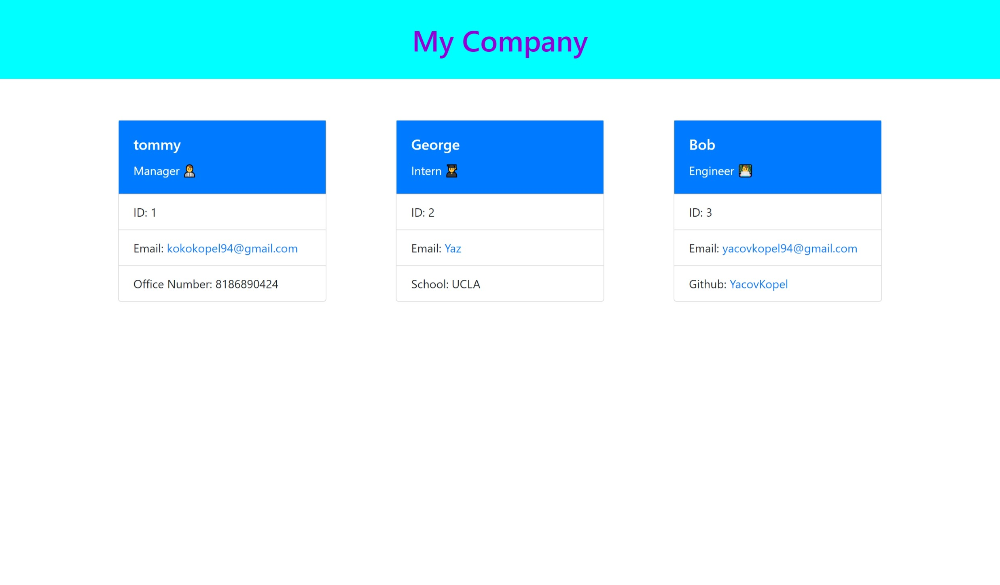

# MyStaff

## Description
This webpage is used to create an employee and manager information center. Users can add different team members to the page that will contain their personal information. Users will be prompted with questions that will fill out the proper sections for each team member. When they are done adding team members, they will have a index.html file with all the team members and their info. 

## Table of Contents
- [Installation](#installation)
- [Usage](#usage)
- [Credits](#credits)
- [License](#license)
  
## Installation
N/A

## Usage
The user will be prompted to fill out the Manager information, including name, email, id number, and office phone number. They will then get the option to add an Engineer, Intern or add no one else. If they choose Engineer or Intern, they will be prompted with som more questions to fill out for each specific position. Users will be asked again if they would like to add any more members. The process continues until the user chooses to add no one else. At that point a customize index.html is created with all the team members and their corelating information.

## Credits
N/A

## Deployment Link
https://yacovkopel.github.io/MyStaff/
https://drive.google.com/file/d/1VC9O0AbAbsmCLglRi2zV8Q6JSOmF-x3q/view

## License
N/A

## Questions
https://github.com/YacovKopel
